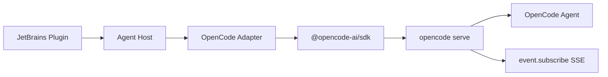

# Agent Runtime 抽离架构建议

## 1. 目标

开发一个类似 `jetbrains-cc-gui` 的 JetBrains 插件，但把 AI Agent 能力抽离成独立可扩展层。未来新增 OpenCode、Aider、Gemini CLI、OpenHands、ACP Agent 等工具时，应通过新增 Adapter 完成，而不是改动 UI 主流程。

## 2. 核心原则

### 2.1 抽象 Agent 生命周期，而不是模型供应商

Claude、Codex、OpenCode 不是普通模型 Provider。它们各自有：

- 会话模型。
- 历史记录格式。
- 权限审批方式。
- 工具调用格式。
- undo/revert 能力。
- server/CLI/stdio/HTTP 等不同通信方式。

因此核心抽象应该是 `AgentRuntime`，不是 `ModelProvider`。

### 2.2 UI 不直接认识具体 Agent

UI 只消费统一事件：

```text
agent.session.created
agent.message.user
agent.message.delta
agent.message.assistant
agent.tool.call
agent.permission.request
agent.usage.updated
agent.error
agent.done
```

UI 可以根据 capability 显示或隐藏控件，但不应该写大量 `if agent == claude/codex/opencode`。

### 2.3 Adapter 负责翻译

每个 Agent Adapter 负责把自身协议翻译成统一协议：

```text
Claude raw event  -> AgentEvent
Codex raw event   -> AgentEvent
OpenCode SSE/API  -> AgentEvent
ACP JSON-RPC      -> AgentEvent
```

## 3. 推荐分层

```text
agent-assistant
├── plugin-shell
│   ├── JetBrains ToolWindow
│   ├── IDE Actions
│   ├── JCEF Webview
│   └── Settings UI
├── agent-core
│   ├── AgentRuntime 接口
│   ├── AgentSession 模型
│   ├── AgentMessage 模型
│   ├── AgentEvent 模型
│   ├── AgentPermission 模型
│   └── AgentCapability 模型
├── agent-host
│   ├── ProcessManager
│   ├── Node/CLI 探测
│   ├── HTTP/SSE 客户端
│   ├── stdio JSON-RPC 客户端
│   └── 日志、心跳、中断、清理
└── agent-adapters
    ├── claude
    ├── codex
    ├── opencode
    └── acp
```

## 4. 核心接口草案

### 4.1 AgentRuntime

```java
public interface AgentRuntime {
    String id();

    AgentCapabilities capabilities();

    AgentHealth health(AgentRuntimeConfig config);

    AgentSessionRef startSession(AgentStartRequest request);

    void sendMessage(AgentSendRequest request, AgentEventSink sink);

    void abort(AgentSessionRef sessionRef);

    List<AgentSessionSummary> listSessions(AgentProjectRef projectRef);

    List<AgentMessage> loadMessages(AgentSessionRef sessionRef);

    void approvePermission(AgentPermissionDecision decision);

    void dispose(AgentSessionRef sessionRef);
}
```

### 4.2 AgentCapabilities

```java
public final class AgentCapabilities {
    boolean supportsStreaming;
    boolean supportsImages;
    boolean supportsHistory;
    boolean supportsRevert;
    boolean supportsPermissions;
    boolean supportsMcp;
    boolean supportsSubagents;
    boolean supportsPlanMode;
    boolean supportsStructuredOutput;
}
```

### 4.3 AgentSessionRef

```java
public final class AgentSessionRef {
    String runtimeId;          // claude / codex / opencode / acp
    String providerSessionId;  // Agent 自己的 session id
    String projectRoot;
    String workspaceId;
}
```

### 4.4 AgentMessage

```java
public final class AgentMessage {
    String id;
    String role;               // user / assistant / system / tool
    List<AgentMessagePart> parts;
    Instant createdAt;
    JsonObject raw;            // 只给调试和恢复用，不进入 UI 逻辑
}
```

### 4.5 AgentPermissionRequest

```java
public final class AgentPermissionRequest {
    String requestId;
    AgentSessionRef sessionRef;
    String action;             // read / edit / bash / webfetch / task / question
    String toolName;
    JsonObject input;
    List<AgentPermissionChoice> choices;
    JsonObject raw;
}
```

## 5. OpenCode Adapter 方案

OpenCode 当前适合集成，因为它已经提供多种机器接口：

- `opencode serve` 可启动 headless HTTP server，并暴露 OpenAPI endpoint。
- `@opencode-ai/sdk` 可创建 server/client，并调用 sessions、messages、files、events 等 API。
- `opencode acp` 支持 Agent Client Protocol，通过 JSON-RPC stdio 与编辑器通信。
- 权限模型为 `allow / ask / deny`，且支持按工具、路径、agent 配置。

### 5.1 第一阶段推荐：OpenCode Server/SDK



优点：

- session、messages、events、files、auth 等 API 较完整。
- HTTP/SSE 比解析 TUI 输出稳定。
- 和 IDE 插件集成形态天然匹配。

代价：

- 需要管理端口、server 生命周期、认证和关闭。
- 需要把 OpenCode 的权限和事件翻译成统一协议。

### 5.2 第二阶段：ACP Adapter


优点：

- ACP 是编辑器与 Agent 之间的标准化方向。
- 未来支持其他 ACP Agent 时复用度更高。

代价：

- 第一版实现成本高于 SDK。
- 需要额外设计 ACP 能力到本项目统一事件的映射。

## 6. 权限抽象建议

统一权限动作不要直接等于某个 Agent 的工具名，而应该先归一化：

| 统一动作 | Claude/Codex 可能来源 | OpenCode 来源 |
|---|---|---|
| `read` | Read/File read | `read` |
| `edit` | Edit/Write/Patch | `edit` |
| `bash` | Bash/Shell | `bash` |
| `webfetch` | Web fetch | `webfetch` |
| `websearch` | Web search | `websearch` |
| `task` | Subagent/Task | `task` |
| `question` | Ask user | `question` |
| `external_directory` | 外部路径访问 | `external_directory` |

UI 只展示统一动作和输入摘要。Adapter 负责把审批结果翻译回具体 Agent。

## 7. 会话和历史抽象建议

本项目自己的历史索引只保存：

```text
runtimeId
providerSessionId
projectRoot
title
createdAt
updatedAt
favorite
lastMessagePreview
```

消息正文优先从 Agent 自身历史读取，必要时做本地缓存。这样可以避免复制不同 Agent 的完整历史格式，也减少历史迁移压力。

## 8. 设计取舍

### 8.1 直接硬编码多个 Agent

优点：

- 第一版最快。
- 文件少，理解成本低。

缺点：

- 每新增一个 Agent 都要改 UI、Session、权限、历史、设置。
- 容易出现 `if claude / if codex / if opencode` 扩散。
- 后续重构成本高。

### 8.2 抽象 AgentRuntime + Adapter

优点：

- 新 Agent 主要新增 Adapter。
- UI 和会话层稳定。
- 易于做 contract tests。
- 适合长期扩展。

缺点：

- 第一版要先定义协议。
- 对 Claude/Codex 的现有能力需要做归一化。

建议选择方案 8.2，但第一版接口只覆盖必须能力，避免过度设计。

