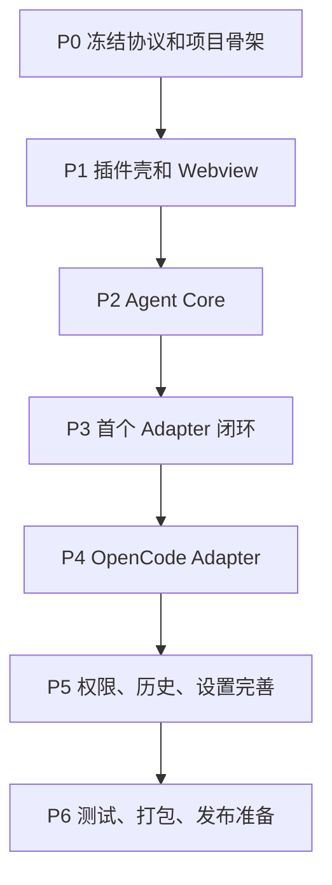

# Agent Assistant 开发计划

## 1. 成功标准

第一阶段完成后，应满足：

- 插件可以在 JetBrains IDE 中打开一个 AI Agent 聊天窗口。
- UI 不直接绑定 Claude/Codex/OpenCode。
- 至少接入一个 Agent Adapter 作为端到端闭环。
- Agent 消息、流式输出、错误、中断、权限请求使用统一协议。
- 后续新增 OpenCode 只需要新增 Adapter 和少量设置项。

第二阶段完成后，应满足：

- Claude、Codex、OpenCode 至少两个 Agent 可切换使用。
- 历史会话、权限审批、模型/Agent 配置通过 capability 驱动。
- 有 Adapter contract tests，确保新增 Agent 不破坏 UI 主流程。

## 2. 总体路线



## 3. 阶段计划

### P0：协议和骨架

目标：

- 创建项目基本结构。
- 冻结第一版 AgentRuntime 接口。
- 定义统一事件、消息、权限、capability 模型。

建议产物：

```text
docs/agent-runtime-architecture.md
docs/development-plan.md
src/main/java/.../agent/core/
```

任务：

1. 定义 `AgentRuntime`。
2. 定义 `AgentEvent`。
3. 定义 `AgentMessage`。
4. 定义 `AgentSessionRef`。
5. 定义 `AgentPermissionRequest`。
6. 定义 `AgentCapabilities`。
7. 写一份 ADR：为什么选择 Adapter 架构。

验证：

- 所有 core model 无 UI/IDE/Node 依赖。
- 可以用单元测试构造一段完整事件流。

### P1：插件壳和 Webview

目标：

- JetBrains 插件能启动。
- 右侧 ToolWindow 能打开。
- Webview 能加载前端页面。
- Java 与前端可以双向通信。

任务：

1. 配置 Gradle IntelliJ Plugin。
2. 注册 ToolWindow。
3. 创建 JCEF Webview。
4. 注入 `window.sendToJava`。
5. 前端实现最小聊天页面。
6. 实现 Java -> Webview 的 `emitAgentEvent`。

验证：

- `./gradlew runIde` 能打开插件。
- 前端点击按钮能发送 bridge event 到 Java。
- Java 能推送测试消息到前端。

### P2：Agent Core 服务

目标：

- UI 通过 `AgentSessionService` 工作，而不是直接调用具体 Adapter。

建议模块：

```text
agent/core/
agent/service/
agent/permission/
agent/history/
```

任务：

1. 实现 `AgentRuntimeRegistry`。
2. 实现 `AgentSessionService`。
3. 实现 `AgentEventBus` 或轻量事件分发。
4. 实现统一中断流程。
5. 实现统一错误展示。
6. 实现内存态 session 管理。

验证：

- 使用 FakeAgentRuntime 可以完成：
  - 新建会话。
  - 发送消息。
  - 收到 delta。
  - 收到 done。
  - 中断。
  - 错误展示。

### P3：首个真实 Adapter 闭环

目标：

- 选择一个最容易跑通的 Agent 作为第一个真实 Adapter。

建议：

- 如果你想最快验证插件壳，先做 `EchoAgentAdapter` 或 `ShellMockAgentAdapter`。
- 如果你想贴近真实业务，先做 Claude 或 Codex 的最小 Adapter。

任务：

1. 新增 Adapter 包。
2. 实现 health。
3. 实现 startSession。
4. 实现 sendMessage。
5. 实现 abort。
6. 实现基础事件转换。
7. 实现 adapter contract tests。

验证：

- 从 IDE UI 发送一句话，真实 Agent 或 mock Agent 能返回流式消息。
- UI 不需要知道具体 Adapter 类型。

### P4：OpenCode Adapter

目标：

- 接入 OpenCode，优先走 `opencode serve` + `@opencode-ai/sdk`。

任务：

1. 探测 `opencode` 可执行文件。
2. 启动或连接 `opencode serve`。
3. 管理端口、hostname、进程和关闭。
4. 调用 OpenCode SDK 创建 session。
5. 调用 `session.prompt` 发送消息。
6. 订阅 OpenCode event stream，转换为统一 `AgentEvent`。
7. 调用 `session.messages` 加载历史。
8. 调用 `session.abort` 实现中断。
9. 映射 OpenCode permission 到统一审批模型。
10. 增加 OpenCode 设置页：可执行文件路径、端口、认证、默认模型。

验证：

- OpenCode health 正常。
- 可创建 session。
- 可发送 prompt。
- 可接收事件。
- 可中断运行。
- 权限 ask 能在插件中弹出审批。

### P5：权限、历史、设置完善

目标：

- 把通用能力从“能跑”补到“可日常使用”。

任务：

1. 权限审批 UI 通用化。
2. `allow once / allow always / deny` 统一表达。
3. 历史列表统一模型。
4. Provider 原生历史读取与本地索引结合。
5. 设置页按 capability 显示选项。
6. 增加 Agent 切换时的状态隔离。
7. 增加日志脱敏。

验证：

- 不同 Agent 会话不会串 sessionId。
- 切换 Agent 后 UI 状态正确。
- 权限审批不会落错项目或窗口。
- 历史恢复后可以继续发送。

### P6：测试、打包、发布准备

目标：

- 达到可内部试用。

任务：

1. Java 单元测试。
2. Webview 组件和 hook 测试。
3. Adapter contract tests。
4. 手动 runIde 验证清单。
5. 插件打包。
6. 写 README、安装文档、故障排查文档。

验证命令：

```bash
./gradlew test
./gradlew check
pnpm --dir webview test
pnpm --dir webview build
./gradlew buildPlugin
```

## 4. 建议目录结构

```text
agent-assistant
├── docs
│   ├── jetbrains-cc-gui-analysis.md
│   ├── agent-runtime-architecture.md
│   └── development-plan.md
├── src/main/java/com/xais/agentassistant
│   ├── plugin
│   ├── webview
│   ├── agent
│   │   ├── core
│   │   ├── service
│   │   ├── host
│   │   ├── permission
│   │   ├── history
│   │   └── adapters
│   │       ├── fake
│   │       ├── claude
│   │       ├── codex
│   │       └── opencode
│   └── settings
├── webview
└── agent-host
```

## 5. 第一版最小范围

建议第一版不要做这些：

- 不做完整 Marketplace 发布。
- 不做所有 Agent。
- 不做复杂多窗口同步。
- 不做完整主题系统。
- 不做复杂 Prompt Enhancer。
- 不做多语言 i18n。

第一版只做：

- ToolWindow。
- 基础聊天 UI。
- AgentRuntime 抽象。
- Fake Adapter。
- 一个真实 Adapter。
- 基础权限弹窗。
- 基础设置页。

## 6. 风险和应对

| 风险 | 影响 | 应对 |
|---|---|---|
| 过早抽象 | 开发慢，接口空泛 | 第一版接口只覆盖发送、事件、中断、权限、历史 |
| Agent 能力差异大 | UI 分支扩散 | 使用 capabilities 控制 UI |
| OpenCode server 生命周期复杂 | 端口冲突、残留进程 | AgentHost 统一管理进程和端口 |
| 权限请求路由错误 | 安全风险 | sessionRef 必须贯穿 request/decision |
| stdout 协议不稳定 | 消息解析脆弱 | 优先使用 SDK/HTTP/SSE/JSON-RPC，少解析 TUI 文本 |
| Webview 与 Java 状态不一致 | UI 卡死或错乱 | 所有后端状态变化都通过 AgentEvent 同步 |

## 7. 推荐下一步

下一步先做 P0：

1. 初始化 Gradle JetBrains 插件骨架。
2. 创建 `agent-core` 包。
3. 写 `AgentRuntime` 和核心模型。
4. 写 `FakeAgentRuntime`。
5. 用单元测试验证事件流。

这一步完成后，再进入 P1 做 ToolWindow 和 Webview。这样可以先把架构核心钉住，不会一开始就被 UI 和具体 Agent 的细节拖偏。
