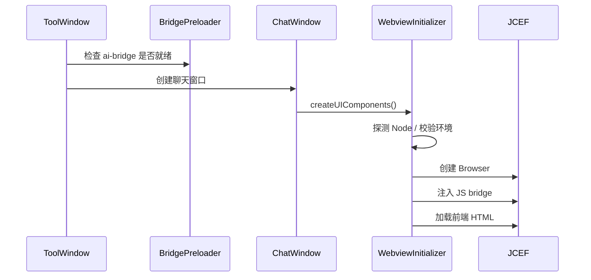
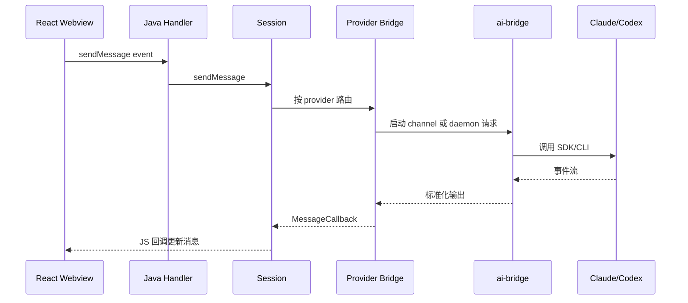
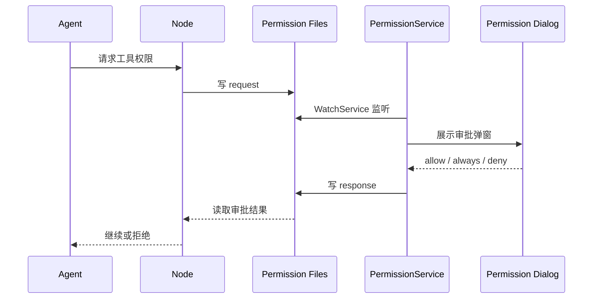

# jetbrains-cc-gui 参考项目分析

## 1. 项目定位

`jetbrains-cc-gui` 是一个 JetBrains IDE 插件，为 Claude Code 和 OpenAI Codex 提供统一的可视化交互界面。它的核心价值不是单纯调用模型，而是把 IDE 上下文、聊天 UI、会话历史、权限审批、文件/终端上下文、Provider 配置和 Node SDK 进程管理组合成一个可用的 AI 编程工作台。

参考仓库路径：

```text
/Users/vity/code/git/jetbrains-cc-gui
```

## 2. 技术栈

| 层 | 技术 | 说明 |
|---|---|---|
| IDE 插件层 | Java 17 + IntelliJ Platform | 注册 ToolWindow、Action、状态栏、设置、项目生命周期 |
| UI 层 | JCEF + React + TypeScript + Vite | 聊天窗口、设置页、历史页、权限弹窗、消息流渲染 |
| Agent 桥接层 | Node.js | 适配 Claude/Codex SDK 或 CLI，统一 stdin/stdout/NDJSON 事件 |
| 构建 | Gradle + npm | Java 插件和 Webview 分别构建，最终打包进插件 |

## 3. 主要模块

### 3.1 插件入口

核心文件：

```text
src/main/resources/META-INF/plugin.xml
src/main/java/com/github/claudecodegui/ui/toolwindow/ClaudeSDKToolWindow.java
src/main/java/com/github/claudecodegui/ui/toolwindow/ClaudeChatWindow.java
src/main/java/com/github/claudecodegui/ui/WebviewInitializer.java
```

职责：

- 注册 `CCG` ToolWindow。
- 注册编辑器、文件树、控制台、VCS 等 IDE Action。
- 创建 JCEF Webview。
- 注入 `window.sendToJava` 等 JavaScript bridge。
- 管理多标签聊天窗口和独立浮窗。
- 项目关闭或窗口销毁时清理进程。

### 3.2 Webview 前端

核心目录：

```text
webview/src/App.tsx
webview/src/components/ChatInputBox/
webview/src/components/history/
webview/src/components/settings/
webview/src/components/mcp/
webview/src/hooks/
webview/src/contexts/
```

职责：

- 渲染聊天消息、工具调用、状态面板。
- 管理 Provider、模型、权限模式、Agent、附件、快捷键等输入状态。
- 展示历史会话、设置、MCP、权限和回退弹窗。
- 通过 bridge event 调用 Java 后端。

### 3.3 会话层

核心目录：

```text
src/main/java/com/github/claudecodegui/session/
```

关键类：

- `ClaudeSession`
- `SessionState`
- `SessionSendService`
- `SessionMessageOrchestrator`
- `SessionLifecycleManager`
- `SessionContextService`
- `StreamMessageCoalescer`
- `MessageParser`
- `MessageMerger`

职责：

- 保存会话状态。
- 发送消息前更新本地消息和 loading/busy 状态。
- 按 Provider 路由到 Claude 或 Codex bridge。
- 加载历史消息。
- 合并流式输出，降低前端刷新压力。
- 拼接打开文件、文件标签等 IDE 上下文。

### 3.4 Provider bridge

核心目录：

```text
src/main/java/com/github/claudecodegui/provider/
src/main/java/com/github/claudecodegui/bridge/
```

关键类：

- `BaseSDKBridge`
- `ClaudeSDKBridge`
- `CodexSDKBridge`
- `DaemonBridge`
- `ProcessManager`
- `NodeDetector`
- `EnvironmentConfigurator`

职责：

- 探测 Node.js。
- 准备 bridge 目录。
- 配置进程环境变量。
- 启动或复用 Node 子进程。
- 解析 Provider 输出。
- 中断、清理进程。

### 3.5 Node ai-bridge

核心目录：

```text
ai-bridge/channel-manager.js
ai-bridge/daemon.js
ai-bridge/channels/
ai-bridge/services/
ai-bridge/utils/
ai-bridge/config/
```

职责：

- 作为 Java 到 Claude/Codex SDK 的适配层。
- `channel-manager.js` 处理一次性命令。
- `daemon.js` 处理长驻进程、SDK 预加载和 NDJSON 请求复用。
- Provider channel 负责把 Claude/Codex 事件转为 Java 可解析输出。
- 注入网络代理、CLI 身份、PATH 等运行环境。

### 3.6 权限系统

核心目录：

```text
src/main/java/com/github/claudecodegui/permission/
ai-bridge/permission-handler.js
ai-bridge/permission-ipc.js
```

职责：

- Node 侧产生工具权限请求。
- 通过文件协议把请求交给 Java。
- Java 侧按项目和 session 路由到权限弹窗。
- 支持 Allow、Allow Always、Deny。
- 支持请求去重、文件就绪等待、决策记忆清理。

### 3.7 历史和回退

核心目录：

```text
src/main/java/com/github/claudecodegui/handler/history/
src/main/java/com/github/claudecodegui/provider/claude/
src/main/java/com/github/claudecodegui/provider/codex/
webview/src/components/history/
```

职责：

- 列出历史会话。
- 收藏、删除、导出历史。
- 恢复 Claude/Codex 历史消息。
- 支持 Claude 侧回退和消息 UUID 修正。

## 4. 关键流程

### 4.1 Webview 初始化



### 4.2 消息发送



### 4.3 权限审批



## 5. 可复用点

适合复用或借鉴：

- ToolWindow + JCEF 的插件壳。
- React Webview 的聊天界面组织方式。
- Java 和 Webview 的 bridge event 模式。
- Node bridge 作为 Agent 适配层。
- daemon 预热降低冷启动。
- 文件协议权限审批思路。
- 会话历史、状态栏和进程清理机制。

需要重构后再复用：

- `SessionSendService` 当前含 Claude/Codex 分支，不适合作为多 Agent 平台核心。
- `ClaudeSession` 命名和职责偏 Claude，需要改成 provider-neutral 的 `AgentSession`。
- Provider 差异泄漏到前端选择器和设置页，需要 capability-driven UI。
- `ai-bridge` 当前以 Claude/Codex 为中心，需要改成通用 `agent-host`。

